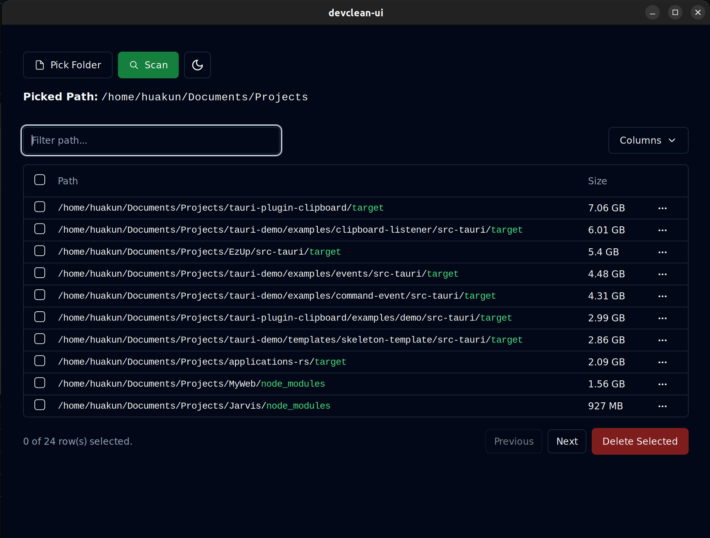
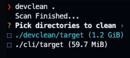
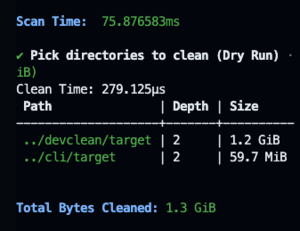

# devclean

 [](https://github.com/HuakunShen/devclean/actions/workflows/ci.yml) [](https://github.com/HuakunShen/devclean/actions/workflows/tauri-ci.yml)

- [devclean](#devclean)
  - [Contribution](#contribution)
    - [Supported Languages/Projects](#supported-languagesprojects)
    - [Adding Support for Other Languages](#adding-support-for-other-languages)
  - [GUI App](#gui-app)
  - [CLI](#cli)
    - [Installation](#installation)
    - [Features](#features)
      - [Find Git Repo with Uncommitted Changes](#find-git-repo-with-uncommitted-changes)
      - [Find Cache and Dependencies Directories To Clean](#find-cache-and-dependencies-directories-to-clean)
        - [Supported Projects / Languages](#supported-projects--languages)
        - [Usage](#usage)

`devclean` is a tool and library for cleaning up development directories.

## Contribution

### Supported Languages/Projects

- [x] Node.js `node_modules`
- [x] Rust `target`

### Adding Support for Other Languages

I currently only support Node.js and Rust projects as these are the languages that contribute the most to my disk usage.

If you would like to see support for other languages, please open an issue or a PR.

It's very easy to add support for another language.

Look at examples in [devclean/src/predicates/languages/node.rs](devclean/src/predicates/languages/node.rs) and [devclean/src/predicates/languages/rust.rs](devclean/src/predicates/languages/rust.rs)

Implement the 4 traits for a language predicate struct

- `LanguagePredicate`
  - Check whether the current path is in a project of this language. 
  - e.g. Check if parent dir has a `package.json`
- `Removable`
  - Check if the current path is removable
  - e.g. Check if the current path is a `node_modules` directory
- `Stop`
  - Check if path traversal should stop
  - e.g. Stop scanning if the current path is a `node_modules` directory
- `Reportable`
  - Sometimes we don't want to remove a directory. This trait is designed as a wrapper layer over `Removable`. If the currently feature is trying to find removable directories to clean, reportable simply calls `is_removable` from `Removable`. In the scanner, `Reportable` is used to determine whether to report the directory as one of the results.
  - For other features like `find-dirty-git`, reportable means the directory should be reported as a dirty git repo.


## GUI App

The GUI App can be found in the [releases](https://github.com/HuakunShen/devclean/releases).



## CLI

### Installation

```bash
cargo install devclean
```

### Features

#### Find Git Repo with Uncommitted Changes

Before removing a directory, it is important to check if there are any uncommitted changes in the directory. This feature finds all git repositories with uncommitted changes.

```bash
devclean find-dirty-git <path>
```

```
❯ devclean find-dirty-git ..
⠁ Scanning: /Users/xxx/Dev/projects/devclean
Path                                | Depth | Size
-------------------------------------+-------+---------
 /Users/xxx/Dev/projects/devclean | 0     | 1.3 GiB
```

#### Find Cache and Dependencies Directories To Clean

Code projects can have large cache and dependency directories that can be cleaned up to save disk space.

##### Supported Projects / Languages

- [ ] Node.js `node_modules`
- [ ] Rust `target`

##### Usage

```bash
devclean <path>
devclean <path> --dry-run   # Won't remove anything
devclean <path> --all       # Select all found directories by default
devclean <path> -y          # Skip confirmation
devclean <path> -t          # Time Scanning and Cleaning
```




