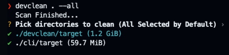

# devclean

 [](https://github.com/HuakunShen/devclean/actions/workflows/ci.yml) [](https://github.com/HuakunShen/devclean/actions/workflows/tauri-ci.yml)

- [devclean](#devclean)
  - [Installation](#installation)
    - [CLI](#cli)
    - [GUI App](#gui-app)
  - [Features](#features)
    - [Find Git Repo with Uncommitted Changes](#find-git-repo-with-uncommitted-changes)
    - [Find Cache and Dependencies Directories To Clean](#find-cache-and-dependencies-directories-to-clean)
      - [Supported Projects / Languages](#supported-projects--languages)
      - [Usage](#usage)

`devclean` is a tool and library for cleaning up development directories.

## Installation

### CLI

```bash
cargo install devclean
```

### GUI App

The GUI App can be found in the [releases](https://github.com/HuakunShen/devclean/releases).

## Features

### Find Git Repo with Uncommitted Changes

Before removing a directory, it is important to check if there are any uncommitted changes in the directory. This feature finds all git repositories with uncommitted changes.

```bash
devclean find-dirty-git <path>
```

```
❯ devclean find-dirty-git ..
⠁ Scanning: /Users/xxx/Dev/projects/devclean
Path                                | Depth | Size
-------------------------------------+-------+---------
 /Users/xxx/Dev/projects/devclean | 0     | 1.3 GiB
```

### Find Cache and Dependencies Directories To Clean

Code projects can have large cache and dependency directories that can be cleaned up to save disk space.

#### Supported Projects / Languages

- [ ] Node.js `node_modules`
- [ ] Rust `target`

#### Usage

```bash
devclean <path>
devclean <path> --dry-run   # Won't remove anything
devclean <path> --all       # Select all found directories by default
devclean <path> -y          # Skip confirmation
devclean <path> -t          # Time Scanning and Cleaning
```




